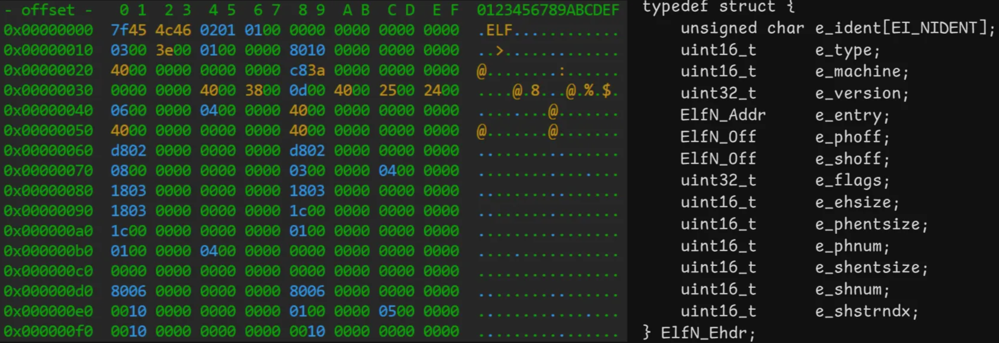
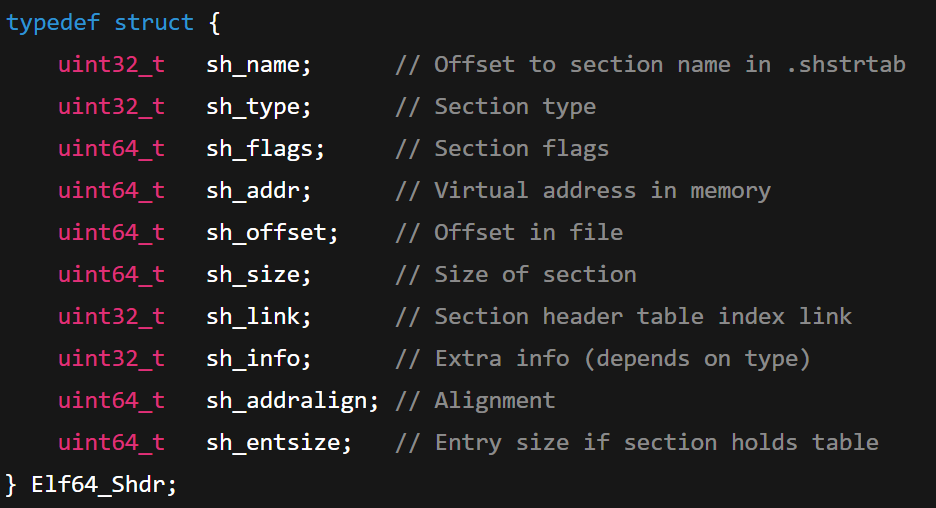
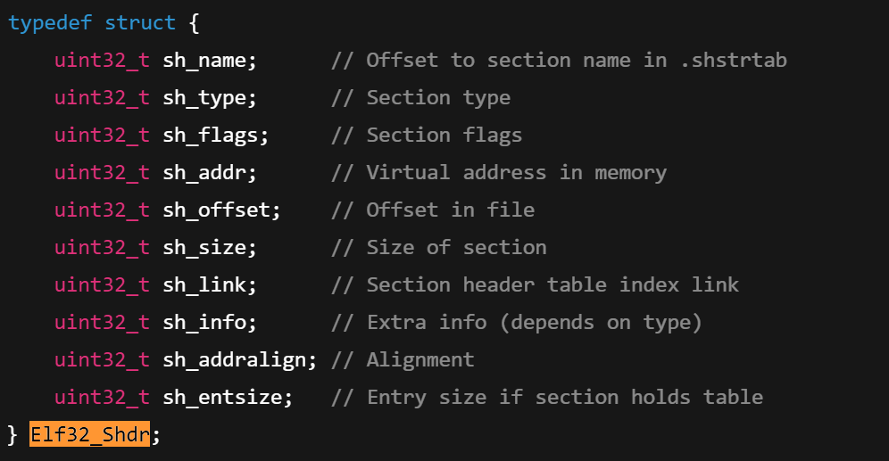
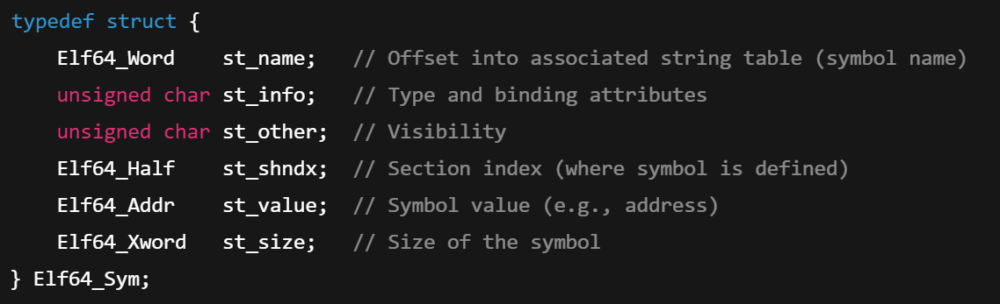
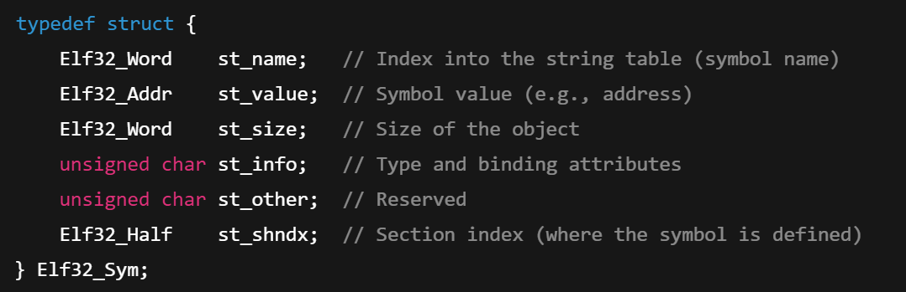

## Resources
- https://man7.org/linux/man-pages/man5/elf.5.html
- https://man7.org/linux/man-pages/man1/nm.1.html
- https://web.archive.org/web/20171219120457/http://nairobi-embedded.org/005_elf_types.html
- https://web.archive.org/web/20171129031316/http://nairobi-embedded.org/040_elf_sec_seg_vma_mappings.html#ref1
- https://www.youtube.com/watch?v=nC1U1LJQL8o&t=125s&ab_channel=stacksmashing
- https://www.youtube.com/watch?v=Ss2e6JauS0Y&t=183s&ab_channel=ChrisKanich
- https://www.youtube.com/watch?v=cX5tQJhuNeY&t=1263s&ab_channel=KayLack

## Project Overview
The goal of this project is to replicate the functionality of the `nm` command, a powerful Linux utility that inspects the **symbol table** of ELF (Executable and Linkable Format) files such as:

- Executables object files (`a.out`, `binary`)
- Relocatable object files (`.o`)
- Shared object files (`.so`)

## What Is a Symbol Table?
A symbol table is a data structure that maps symbolic names (like function and variable names) to their addresses or offsets within a binary file. These mappings are created during compilation and linking. The nature of the mapping depends on the ELF file type:

- **Executable/Shared Object Files**: Symbols are resolved to actual memory addresses where they will reside when the program is loaded.
- **Relocatable Object Files**: Symbols are represented as offsets or placeholders that the linker will resolve into final addresses when creating an executable or shared library.

## ELF File Structure
An ELF file format is defined in `<elf.h>`. To analyze it, we follow these key steps:

### 1. Validate the ELF File
The first 16 bytes of the file are the **`e_ident` array**, containing critical metadata (will talk about the ones relevant for the project):

- `e_ident[EI_MAG0..3]` = `0x7f, 'E', 'L', 'F'`: confirms ELF magic number.
- `e_ident[EI_CLASS]` = `ELFCLASS32` or `ELFCLASS64`: determines architecture.
- `e_ident[EI_DATA]` = endianness (little/big).

Once validated, cast the content of the file to an ElfN_Ehdr, where N is based on the`EI_CLASS`value:

```c
ElfN_Ehdr *header = (ElfN_Ehdr *)*file_content*;
```

<p align="left">
  
</p>

### 2. **Get Section Header Table**
From the ELF header, we extract three key fields to find the Section Header Table:

- `e_shoff`: file offset to the **Section Header Table**.
- `e_shnum`: number of entries in the section table.
- `e_shentsize`: size of each section header.

We can then access the array of section headers (`ElfN_Shdr`):

```c
ElfN_Shdr *sh_arr = (ElfN_Shdr *)(file_content + header->e_shoff);
```

Each `ElfN_Shdr` have all the infos of a section within the file:

<p align="left">
  
   
</p>

### 3. **Find the Symbol Table and String Table**
Now we iterate through the section header array to find the symbol table. Symbols can be in the section with sh_type:

- **`SHT_SYMTAB`**: This is the primary symbol table, containing a comprehensive list of all symbols, including static variables and local functions. It is essential for linking.

When we find a section with type `SHT_SYMTAB`, we have located the symbol table. From its header, we use the sh_offset to find the array of (`ElfN_Sym`):

```c
ElfN_Sym *symtab = (ElfN_Sym *)(*file_content* + sections[i].sh_offset);
int n_sym = symtab->sh_size / sizeof(ElfN_Sym);
```

<p align="left">
  
  
</p>

Also imporatnt information to save is `sh_link` variable - more on that later.

### 4. **Get and Display Symbol Information**
Now we iterate through the symbol array and display each entry informations like the nm command does:  `[VALUE] [TYPE] [NAME]`

<details>
<summary>Get Symbol Value</summary>

`st_value` is the int representation of the symbol offset in the file mapping. It needs to be displayed as hexadecimal as a 32/64 bit address based on `EI_CLASS` value.

</details>
<details>
<summary>Get Symbol Type</summary>

The `st_info` field in the `ElfN_Sym`structure contain **two information** in a single byte:

- The **symbol’s binding** (global, local, etc.)
- The **symbol’s type** (function, object, section, etc.)

You can extract them using the macros provided in `<elf.h>`:

```c
uint64_t bind = ELFN_ST_BIND(st_info)
uint64_t type = ELFN_ST_TYPE(st_info)
```

### 1. **Binding (visibility of the symbol):**

How the linker can view the symbol across multiple object files:

| Binding | Value | Meaning |
| --- | --- | --- |
| `STB_LOCAL` | 0 | Local symbol |
| `STB_GLOBAL` | 1 | Global symbol |
| `STB_WEAK` | 2 | Weak symbol (overridable) |

### 2. **Type (what kind of symbol it is):**

This tells you what the symbol represents in the program:

| Type | Value | Meaning |
| --- | --- | --- |
| `STT_NOTYPE` | 0 | No type specified |
| `STT_OBJECT` | 1 | Data object (variable) |
| `STT_FUNC` | 2 | Function or executable code |
| `STT_SECTION` | 3 | Section name |
| `STT_FILE` | 4 | Source file name |
| `STT_COMMON` | 5 | Uninitialized common block |
| `STT_TLS` | 6 | Thread-local storage object |

### `nm` Symbol Type Characters Table

| Symbol Char | Meaning | Binding | Type | Section |
| --- | --- | --- | --- | --- |
| `U` | Undefined symbol | GLOBAL/WEAK | Any | `SHN_UNDEF` (undefined) |
| `W` | Weak symbol (undefined) | WEAK | Any | `SHN_UNDEF` |
| `w` | Weak symbol (defined) | WEAK | Any | Not `SHN_UNDEF` |
| `T` | Function in `.text` (code) section | GLOBAL | `STT_FUNC` | `.text` or executable section |
| `t` | Function in `.text` (code) section | LOCAL | `STT_FUNC` | `.text` or executable section |
| `D` | Initialized variable in `.data` section | GLOBAL | `STT_OBJECT` | `.data` |
| `d` | Initialized variable in `.data` section | LOCAL | `STT_OBJECT` | `.data` |
| `B` | Uninitialized variable in `.bss` section | GLOBAL | `STT_OBJECT` | `.bss` |
| `b` | Uninitialized variable in `.bss` section | LOCAL | `STT_OBJECT` | `.bss` |
| `R` | Read-only object (e.g., const data) | GLOBAL | `STT_OBJECT` | `.rodata` |
| `r` | Read-only object | LOCAL | `STT_OBJECT` | `.rodata` |
| `A` | Absolute symbol | Any | Any | `SHN_ABS` |
| `C` | Common symbol (not allocated yet) | GLOBAL | `STT_OBJECT` | `SHN_COMMON` |
| `N` | Debugging symbol | LOCAL | `STT_SECTION` | Usually in `.debug` section |
| `?` | Unknown/other | Any | Any | Not matched above |

> Note:
> 
- **Uppercase**: Global binding (`STB_GLOBAL`)
- **Lowercase**: Local binding (`STB_LOCAL`)
- Special handling for `STB_WEAK` as `W/w`
</details>

<details>
<summary>A</summary>
An **absolute symbol** is a special entry in the symbol table whose "address" is a fixed, constant value, not a location in the program's memory. It’s often used for things like version tags, build numbers, or assembler constants.

**Key points:**

- **Absolute symbols** do not refer to any location in any section (.text, .data, .bss, etc.) of the program.
- Their value is treated as a constant by the linker and loader.

### Presence in Output

- **Symbol Table:** Yes, absolute symbols are present in the symbol table. You’ll see them with type `A` (uppercase) or `a` (lowercase) in `nm` output.
- **Object File (.o):** They exist in the symbol table of object files.
- **Final Executable:** They exist in the symbol table of executables too (unless stripped).
- **Sections:** They are **not** present in any program section. There is no allocated space for them in the binary.

### Usage

- Absolute symbols are mostly used by linkers, assemblers, and loaders as "labels for values," not for code or data. They are not "real" variables or functions, so you cannot take their address or access them at runtime.

### Example

If you define an absolute global symbol in assembly:
```asm
.set ABSOLUTE, 42
.globl ABSOLUTE
```
And inspect with `nm`:
```
000000000000002a A ABSOLUTE
```
It is present in the symbol table only; its value (`0x2a` or 42) is just a constant.

---

**Summary:**  
An absolute symbol is present in the symbol table (in object files and executables), but it does **not** correspond to a location in any program section or actual storage. It is a symbol for a constant value, not code or data.
</details>

<details>
<summary>B</summary>
A symbol of type **'b'** refers to a symbol in the **BSS (Block Started by Symbol) segment**.

### What is the BSS Segment?

The BSS segment is a portion of a program's memory space that contains **uninitialized static and global variables**. When the program is loaded into memory, the operating system loader allocates memory for the BSS segment, but it doesn't need to load any data from the object file itself. This is because all variables in the BSS segment are initialized to zero by default at program startup.

This is an optimization: instead of storing a large block of zeros in the executable file on disk, the file only stores information about the *size* of the BSS segment. The loader then allocates and zero-initializes that amount of memory when the program starts.

A **lowercase 'b'** specifically denotes a local (static) symbol in the BSS section. A **uppercase 'B'** denotes a global symbol in the BSS section.

### Assembly Language declaration


````asm
.section .bss
# To declare a local uninitialized variable (which corresponds to a 'b' symbol)
.lcomm my_local_var, 4
# To declare a global uninitialized variable (which corresponds to a 'B' symbol)
.comm my_global_var, 8
````

### C Language declaration

````c
// To declare a local uninitialized variable (which corresponds to a 'b' symbol)
int global_uninitialized_var;
// To declare a global uninitialized variable (which corresponds to a 'B' symbol)
static int local_uninitialized_var;

int main() {
    return 0;
}
````
</details>

<details>
<summary>Get Symbol Name</summary>

The previously `sh_link` attribute of a `.symtab` or `.dyntab`, is the index to use in the Section Header Array`sh_arr` to find a special Section Header. At its `sh_offset`, this section has an array of null-terminated strings representing the actual names of the symbols. 

This String Table (`strtab`) can be dereferenciate by each symbol `st_name` variable to retrieve and display the string name of that symbol. 

```c
Elf_Shdr *strtab = &sh_arr[symtab->sh_link];
char *names = file_content + strtab->sh_offset;
char *sym_name = names + *symbol*.st_name;
```

Excellent question. This gets to the heart of how compilers handle variables with static storage duration.

The variable `bho` is displayed by `nm` because of the `static` keyword. Let's break down exactly why.

### The Role of the `static` Keyword Inside a Function

When you declare a variable inside a function, it normally has **automatic storage duration**. This means:
*   It's created on the **stack** when the function is called.
*   It's destroyed when the function exits.
*   It does not have a permanent memory address and is not a symbol in the object file's symbol table.

However, when you add the `static` keyword to a variable inside a function, its behavior completely changes:

1.  **Storage Duration:** It gets **static storage duration**. This means the variable is allocated once when the program is loaded and it exists for the *entire lifetime of the program*. It is **not** stored on the stack.

2.  **Memory Location:** Because it has a permanent location, it must be stored in one of the program's data segments, just like a global or file-level static variable.
    *   Since `bho` is initialized to a non-zero value (`static int bho = 1;`), the compiler places it in the **initialized data section** (often named `.data`).

3.  **Symbol Table:** Because `bho` is placed in the `.data` section, it must have an entry in the object file's **symbol table** so the linker knows where it is. This is why `nm` can see it.

### Analyzing the `nm` Output for `bho`

Let's look at the specific line from your `nm` output:

```
0000000000000008 d bho.0
```

*   **`d` (Symbol Type):** This is the key. A lowercase `d` means the symbol is in the **initialized data section** and it is a **local symbol** (not visible to other object files). This perfectly matches our variable:
    *   **Initialized:** `bho = 1`.
    *   **Local:** The `static` keyword, when used inside a function, gives the variable *no linkage*, meaning it's private to that function and the compiler treats it as a local symbol within the object file.

*   **`bho.0` (Symbol Name):** You declared the variable as `bho`, but the compiler named it `bho.0`. Compilers often do this to prevent name collisions. If you had another function in the same file with its own `static int bho;`, the compiler might name it `bho.1` to keep the symbols unique within the object file.

In summary, **`bho` is displayed by `nm` because the `static` keyword moved it from the temporary function stack to a permanent location in the `.data` section, requiring it to be listed as a local symbol in the object file's symbol table.**